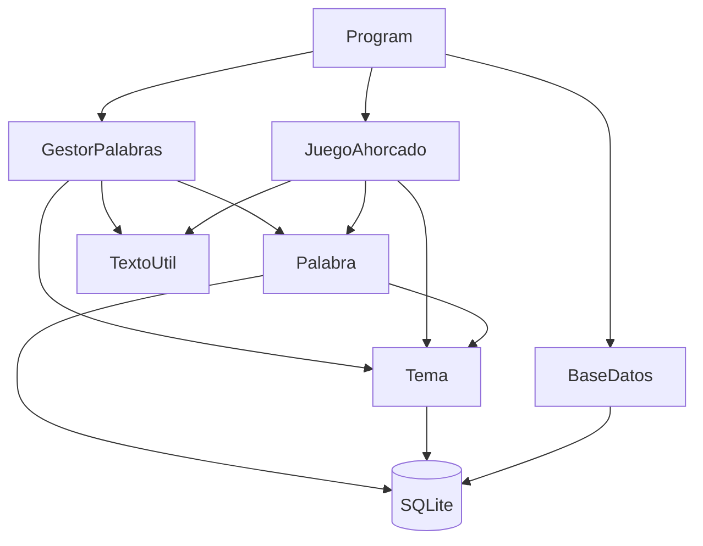
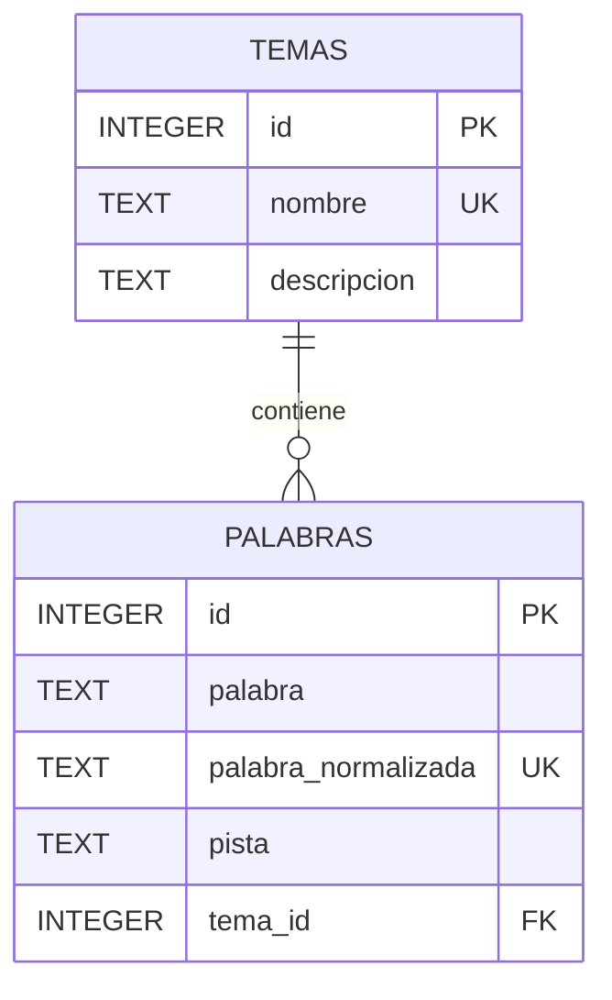
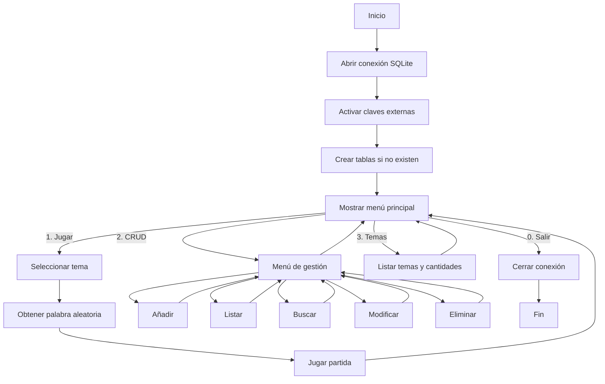

# Juego del Ahorcado con C# y SQLite

Aplicación de consola educativa que implementa el clásico **juego del ahorcado** utilizando **C#**, **.NET 8** y una base de datos **SQLite**.

El proyecto está diseñado para alumnado que está aprendiendo programación orientada a objetos, acceso a bases de datos y operaciones CRUD. Por ese motivo se priorizan la **legibilidad**, la separación clara de responsabilidades y el código fácil de modificar, aunque algunas decisiones no sean las más eficientes para una aplicación con millones de registros.

La base de datos incluida contiene **30 temas** y **450 palabras en español de España**, cada una acompañada de una pista. El jugador puede elegir un tema concreto o utilizar palabras de todos los temas.

---

## Índice

- [Características principales](#características-principales)
- [Objetivos didácticos](#objetivos-didácticos)
- [Tecnologías utilizadas](#tecnologías-utilizadas)
- [Requisitos](#requisitos)
- [Instalación y ejecución](#instalación-y-ejecución)
- [Cómo jugar](#cómo-jugar)
- [Gestión de palabras: CRUD completo](#gestión-de-palabras-crud-completo)
- [Estructura del proyecto](#estructura-del-proyecto)
- [Diseño orientado a objetos](#diseño-orientado-a-objetos)
- [Mapeo de tablas a clases](#mapeo-de-tablas-a-clases)
- [Base de datos](#base-de-datos)
- [Relación entre las tablas mediante WHERE](#relación-entre-las-tablas-mediante-where)
- [Consultas parametrizadas y prevención de SQL Injection](#consultas-parametrizadas-y-prevención-de-sql-injection)
- [Prevención de palabras duplicadas](#prevención-de-palabras-duplicadas)
- [Tratamiento de tildes, mayúsculas y espacios](#tratamiento-de-tildes-mayúsculas-y-espacios)
- [Contenido de la base de datos](#contenido-de-la-base-de-datos)
- [Flujo general del programa](#flujo-general-del-programa)
- [Decisiones de diseño](#decisiones-de-diseño)
- [Posibles ampliaciones](#posibles-ampliaciones)
- [Solución de problemas](#solución-de-problemas)
- [Uso educativo](#uso-educativo)

---

## Características principales

- Juego del ahorcado completamente funcional en consola.
- Selección de un tema específico antes de comenzar la partida.
- Opción para jugar utilizando todos los temas.
- Selección aleatoria de palabras desde SQLite.
- Siete errores permitidos antes de perder.
- Dibujo progresivo del ahorcado mediante caracteres de texto.
- Posibilidad de introducir una letra o intentar resolver la palabra completa.
- Comando `PISTA` para mostrar una ayuda sin perder un intento.
- Comando `SALIR` para abandonar la partida y descubrir la solución.
- Las letras repetidas no descuentan intentos.
- Los espacios y guiones se muestran desde el principio.
- Las vocales con y sin tilde se consideran equivalentes durante el juego.
- La `ñ` se conserva como una letra diferente de la `n`.
- CRUD completo de palabras:
  - Crear.
  - Consultar y listar.
  - Buscar.
  - Modificar.
  - Eliminar.
- Comprobación de palabras duplicadas antes de insertarlas o modificarlas.
- Consultas SQL parametrizadas con `AddWithValue`.
- Relación entre las tablas `palabras` y `temas` mediante `WHERE`.
- Mapeo de cada tabla a una clase de C#.
- Base de datos preparada con 450 palabras y 30 temas.
- Código dividido en pocos ficheros y comentado con finalidad didáctica.

---

## Objetivos didácticos

Este proyecto permite practicar de forma conjunta varios contenidos fundamentales de C# y bases de datos.

### Programación orientada a objetos

- Creación de clases y objetos.
- Atributos privados y propiedades públicas.
- Constructores con diferentes parámetros.
- Encapsulación.
- Métodos de instancia.
- Métodos estáticos.
- Sobrescritura de `ToString()`.
- Composición de objetos: una `Palabra` contiene un objeto `Tema`.
- Separación de responsabilidades entre clases.

### Acceso a bases de datos

- Conexión con una base de datos SQLite.
- Uso de `SqliteConnection`.
- Uso de `SqliteCommand`.
- Uso de `SqliteDataReader`.
- Uso de `ExecuteNonQuery()`.
- Uso de `ExecuteReader()`.
- Uso de `ExecuteScalar()`.
- Consultas `SELECT`, `INSERT`, `UPDATE` y `DELETE`.
- Consultas parametrizadas.
- Claves primarias y claves externas.
- Restricciones `UNIQUE` y `NOT NULL`.
- Índices.
- Relación de dos tablas mediante una condición `WHERE`.
- Conversión de las filas de una consulta en objetos de C#.

### Programación general

- Menús cíclicos con `while`.
- Selección de opciones con `switch`.
- Condicionales.
- Listas genéricas con `List<T>`.
- Validación de datos introducidos por consola.
- Métodos auxiliares reutilizables.
- Manipulación y normalización de cadenas.
- Uso de `StringBuilder`.
- Valores nulos mediante tipos anulables como `Palabra?` y `Tema?`.
- Codificación UTF-8 para mostrar correctamente tildes y eñes.

---

## Tecnologías utilizadas

| Tecnología | Uso en el proyecto |
|---|---|
| C# | Lenguaje principal |
| .NET 8 | Plataforma de ejecución |
| SQLite | Base de datos almacenada en un único fichero |
| Microsoft.Data.Sqlite | Biblioteca oficial de acceso a SQLite para .NET |
| ADO.NET | Modelo utilizado para ejecutar órdenes SQL y leer resultados |

El proyecto utiliza esta dependencia de NuGet:

```xml
<PackageReference Include="Microsoft.Data.Sqlite" Version="8.0.12" />
```

No se utiliza ningún ORM. Las consultas SQL se escriben de forma explícita para que el alumnado pueda ver y comprender qué operación se está realizando.

---

## Requisitos

Para ejecutar el proyecto es necesario disponer de:

- Windows, GNU/Linux o macOS.
- El SDK de **.NET 8** o una versión compatible con `net8.0`.
- Visual Studio 2022, Visual Studio Code, Rider o cualquier editor compatible con C#.
- El fichero `ahorcado.db` incluido en el proyecto.

Puedes comprobar si .NET está instalado ejecutando:

```bash
dotnet --version
```

La versión mostrada debe ser 8 o superior.

---

## Instalación y ejecución

### Opción 1: Visual Studio

1. Descarga o clona el repositorio.
2. Abre el fichero `AhorcadoConSQLite.csproj` con Visual Studio.
3. Espera a que Visual Studio restaure automáticamente los paquetes NuGet.
4. Comprueba que `ahorcado.db` aparece dentro del proyecto.
5. Ejecuta el programa con `Ctrl + F5`.

### Opción 2: Terminal o Visual Studio Code

Clona el repositorio y entra en su carpeta:

```bash
git clone <URL_DEL_REPOSITORIO>
cd AhorcadoConSQLiteMapeado
```

Restaura las dependencias:

```bash
dotnet restore
```

Ejecuta el programa:

```bash
dotnet run
```

### Opción 3: Proyecto descargado como ZIP

1. Descomprime el archivo.
2. Abre una terminal dentro de la carpeta del proyecto.
3. Ejecuta:

```bash
dotnet restore
dotnet run
```

### Compilar el proyecto

```bash
dotnet build
```

### Generar una versión publicable

Por ejemplo, para Windows de 64 bits:

```bash
dotnet publish -c Release -r win-x64 --self-contained false
```

El fichero del proyecto indica que `ahorcado.db` debe copiarse al directorio de salida:

```xml
<None Update="ahorcado.db">
  <CopyToOutputDirectory>PreserveNewest</CopyToOutputDirectory>
</None>
```

---

## Cómo jugar

Al iniciar el programa aparece el menú principal:

```text
====================================
          JUEGO DEL AHORCADO
====================================
1. Jugar
2. Gestionar palabras (CRUD)
3. Mostrar temas disponibles
0. Salir
------------------------------------
Selecciona una opción:
```

### Selección del tema

Antes de comenzar una partida se muestran todos los temas disponibles:

```text
ELIGE UN TEMA
=============
0. Todos los temas
1. Animales (15)
2. Aves (15)
3. Vida marina (15)
...
Tema:
```

- Escribe `0` para utilizar cualquier tema.
- Escribe el identificador de un tema para jugar únicamente con palabras de ese tema.

### Durante la partida

Puedes introducir:

| Entrada | Acción |
|---|---|
| Una letra | Comprueba si aparece en la palabra |
| Una palabra o expresión | Intenta resolver directamente la solución |
| `PISTA` | Muestra la pista asociada |
| `SALIR` | Abandona la partida y muestra la palabra |

Ejemplo:

```text
JUEGO DEL AHORCADO
==================
Tema: Animales

  +---+
  |   |
  O   |
      |
     ===

_ _ _ _ _ _ _ _

Errores: 2 de 7
Letras usadas: a, e, r
Escribe una letra, una palabra, PISTA o SALIR:
```

### Reglas importantes

- Se permiten como máximo siete errores.
- Una letra repetida no cuenta como error adicional.
- Los espacios y guiones aparecen visibles desde el inicio.
- Introducir `a` también descubre una `á`.
- Introducir `u` también descubre `ú` y `ü`.
- La `ñ` no se considera igual que la `n`.
- La pista puede consultarse en cualquier momento y no resta intentos.

---

## Gestión de palabras: CRUD completo

Desde la opción `2` del menú principal se accede al mantenimiento de palabras:

```text
GESTIÓN DE PALABRAS
===================
1. Añadir palabra
2. Mostrar todas las palabras
3. Buscar palabra
4. Modificar palabra
5. Eliminar palabra
0. Volver al menú principal
```

### Crear una palabra

El programa solicita:

1. La palabra o expresión.
2. Una pista.
3. El tema al que pertenece.

Antes de pedir la pista y el tema se comprueba que la palabra no exista ya.

Se permiten:

- Letras.
- Espacios.
- Guiones.

Ejemplos válidos:

```text
ordenador
ciencia ficción
arco-iris
```

Ejemplos no válidos:

```text
casa123
perro!
50 metros
```

### Consultar palabras

La opción de listado recupera todos los registros y muestra:

- Identificador.
- Palabra.
- Tema.
- Pista.

Ejemplo:

```text
25 - hipopótamo [Animales]
    Pista: Pasa gran parte del día dentro del agua.
```

### Buscar palabras

La búsqueda no exige escribir la palabra completa. Utiliza `LIKE` y permite localizar coincidencias parciales.

Por ejemplo, al buscar:

```text
astro
```

se pueden recuperar palabras que contengan ese texto normalizado.

### Modificar una palabra

Para modificar un registro se solicita su ID. Después se puede:

- Cambiar la palabra.
- Conservar la palabra pulsando `Enter`.
- Cambiar la pista.
- Conservar la pista pulsando `Enter`.
- Cambiar el tema.
- Mantener el tema actual.

La comprobación de duplicados ignora el registro que se está modificando, para que una palabra no sea considerada duplicada de sí misma.

### Eliminar una palabra

Antes de borrar se muestran sus datos y se solicita confirmación:

```text
¿Seguro que quieres eliminarla? (s/n):
```

Solo se ejecuta el `DELETE` si el usuario responde afirmativamente.

### Correspondencia CRUD

| Operación | Método principal | SQL utilizado |
|---|---|---|
| Create | `Palabra.Insertar()` | `INSERT` |
| Read | `Palabra.Listar()` | `SELECT` |
| Read | `Palabra.Buscar()` | `SELECT ... LIKE` |
| Read | `Palabra.BuscarPorId()` | `SELECT ... WHERE id = @id` |
| Update | `Palabra.Actualizar()` | `UPDATE` |
| Delete | `Palabra.Borrar()` | `DELETE` |

---

## Estructura del proyecto

```text
AhorcadoConSQLiteMapeado/
│
├── Program.cs
├── BaseDatos.cs
├── Tema.cs
├── Palabra.cs
├── TextoUtil.cs
├── GestorPalabras.cs
├── JuegoAhorcado.cs
├── AhorcadoConSQLite.csproj
├── ahorcado.db
└── README.md
```

### `Program.cs`

Es el punto de entrada de la aplicación.

Responsabilidades:

- Configurar la entrada y salida en UTF-8.
- Crear y abrir la conexión.
- Solicitar la creación de las tablas si no existen.
- Crear los objetos `GestorPalabras` y `JuegoAhorcado`.
- Mostrar el menú principal.
- Dirigir al usuario hacia el juego, el CRUD o el listado de temas.

### `BaseDatos.cs`

Centraliza los aspectos generales de SQLite:

- Cadena de conexión.
- Creación del objeto `SqliteConnection`.
- Activación de las claves externas.
- Creación de las tablas.
- Creación del índice de palabras por tema.

No contiene la lógica del juego ni el CRUD de una palabra concreta.

### `Tema.cs`

Representa la tabla `temas`.

Incluye:

- Propiedades `Id`, `Nombre` y `Descripcion`.
- Constructores.
- `ToString()`.
- `Listar()`.
- `BuscarPorId()`.

Los temas incluidos se utilizan como categorías predefinidas. La interfaz actual permite consultarlos, pero no incluye un CRUD de temas.

### `Palabra.cs`

Representa la tabla `palabras` y concentra sus operaciones de acceso a datos.

Incluye:

- Propiedades `Id`, `Texto`, `Pista` y `Tema`.
- Constructores.
- `ToString()`.
- CRUD completo.
- Comprobación de duplicados.
- Búsquedas.
- Selección aleatoria.
- Recuento de palabras por tema.
- Conversión de cada fila leída en objetos `Tema` y `Palabra`.

### `TextoUtil.cs`

Agrupa operaciones relacionadas con texto y entrada por consola:

- Normalización de cadenas.
- Normalización de caracteres.
- Comparación ignorando tildes y mayúsculas.
- Validación de palabras.
- Lectura de textos obligatorios.
- Lectura de enteros positivos.
- Confirmaciones.
- Pausas de consola.

Los métodos que podrían estar en una clase separada de entrada se han reunido aquí deliberadamente para reducir el número de ficheros y facilitar el seguimiento del proyecto.

### `GestorPalabras.cs`

Se ocupa de la interfaz de consola del CRUD.

No escribe directamente las sentencias SQL. En su lugar, crea o recupera objetos `Palabra` y llama a sus métodos:

```csharp
palabra.Insertar(conexion);
palabra.Actualizar(conexion);
palabra.Borrar(conexion);
```

### `JuegoAhorcado.cs`

Contiene la lógica de las partidas:

- Selección del tema.
- Obtención de una palabra aleatoria.
- Registro de letras usadas.
- Control de errores.
- Comprobación de letras.
- Comparación de la solución completa.
- Presentación de la palabra oculta.
- Dibujo progresivo del ahorcado.
- Victoria, derrota y abandono.

### `AhorcadoConSQLite.csproj`

Define:

- El tipo de proyecto.
- La versión de .NET.
- La dependencia `Microsoft.Data.Sqlite`.
- La copia de `ahorcado.db` al directorio de salida.

### `ahorcado.db`

Es el fichero SQLite que contiene:

- La tabla `temas`.
- La tabla `palabras`.
- Los 30 temas iniciales.
- Las 450 palabras iniciales.
- Las pistas.
- Las relaciones entre palabras y temas.

---

## Diseño orientado a objetos

La aplicación separa la interfaz, el juego y el acceso a los datos.



La clase `Program` coordina el programa, pero no contiene las consultas del CRUD ni la lógica completa de una partida.

---

## Mapeo de tablas a clases

El proyecto sigue una versión sencilla del patrón **Registro Activo**.

Cada tabla principal se corresponde con una clase:

```text
Tabla temas     → clase Tema
Tabla palabras  → clase Palabra
```

Cada objeto representa conceptualmente una fila de su tabla.

### Ejemplo con una palabra nueva

```csharp
Tema? tema = Tema.BuscarPorId(conexion, 1);

if (tema != null)
{
    Palabra palabra = new Palabra(
        "elefante",
        "Es el animal terrestre más grande y tiene trompa.",
        tema);

    bool insertada = palabra.Insertar(conexion);
}
```

### Composición entre `Palabra` y `Tema`

En SQLite, la tabla `palabras` guarda la clave externa `tema_id`. Sin embargo, en C# cada palabra contiene el objeto `Tema` completo:

```csharp
public Tema Tema
{
    get { return tema; }
    set { tema = value; }
}
```

Esto permite escribir:

```csharp
Console.WriteLine(palabra.Tema.Nombre);
```

En una inserción o modificación, la clave externa se obtiene mediante:

```csharp
palabra.Tema.Id
```

---

## Base de datos

La base de datos utiliza dos tablas relacionadas.



### Tabla `temas`

| Columna | Tipo | Restricciones | Finalidad |
|---|---|---|---|
| `id` | `INTEGER` | Clave primaria y autoincremental | Identifica el tema |
| `nombre` | `TEXT` | Obligatorio y único | Nombre visible de la categoría |
| `descripcion` | `TEXT` | Obligatorio | Explicación breve del contenido |

SQL utilizado:

```sql
CREATE TABLE IF NOT EXISTS temas (
    id INTEGER PRIMARY KEY AUTOINCREMENT,
    nombre TEXT NOT NULL UNIQUE COLLATE NOCASE,
    descripcion TEXT NOT NULL
);
```

### Tabla `palabras`

| Columna | Tipo | Restricciones | Finalidad |
|---|---|---|---|
| `id` | `INTEGER` | Clave primaria y autoincremental | Identifica la palabra |
| `palabra` | `TEXT` | Obligatorio | Texto original mostrado al jugador |
| `palabra_normalizada` | `TEXT` | Obligatorio y único | Versión usada para comparar y evitar duplicados |
| `pista` | `TEXT` | Obligatorio | Ayuda disponible durante la partida |
| `tema_id` | `INTEGER` | Obligatorio y clave externa | Tema al que pertenece |

SQL utilizado:

```sql
CREATE TABLE IF NOT EXISTS palabras (
    id INTEGER PRIMARY KEY AUTOINCREMENT,
    palabra TEXT NOT NULL,
    palabra_normalizada TEXT NOT NULL UNIQUE,
    pista TEXT NOT NULL,
    tema_id INTEGER NOT NULL,
    FOREIGN KEY (tema_id)
        REFERENCES temas(id)
        ON DELETE RESTRICT
);
```

### Claves externas

SQLite necesita activar explícitamente la comprobación de claves externas en cada conexión:

```sql
PRAGMA foreign_keys = ON;
```

La opción `ON DELETE RESTRICT` evita eliminar un tema mientras existan palabras asociadas a él.

### Índice por tema

```sql
CREATE INDEX IF NOT EXISTS idx_palabras_tema
ON palabras (tema_id);
```

El índice facilita las consultas que filtran o cuentan palabras de un tema.

---

## Relación entre las tablas mediante WHERE

Las consultas que necesitan datos de las dos tablas utilizan una unión implícita mediante `WHERE`:

```sql
SELECT
    p.id AS palabra_id,
    p.palabra,
    p.pista,
    t.id AS tema_id,
    t.nombre,
    t.descripcion
FROM palabras p, temas t
WHERE p.tema_id = t.id
ORDER BY p.palabra;
```

Los alias simplifican la consulta:

```text
p → palabras
t → temas
```

La condición importante es:

```sql
WHERE p.tema_id = t.id
```

Esta condición indica qué fila de `temas` corresponde a cada palabra.

Si se omitiera, SQLite combinaría cada palabra con todos los temas y produciría un producto cartesiano incorrecto.

Para buscar una palabra concreta se añade otra condición:

```sql
WHERE p.tema_id = t.id
AND p.id = @id;
```

Para filtrar por texto:

```sql
WHERE p.tema_id = t.id
AND p.palabra_normalizada LIKE @texto;
```

---

## Consultas parametrizadas y prevención de SQL Injection

Los valores escritos por el usuario no se concatenan dentro del SQL.

Ejemplo incorrecto y peligroso:

```csharp
string sql =
    "SELECT * FROM palabras WHERE palabra = '" + texto + "'";
```

Ejemplo utilizado en el proyecto:

```csharp
string sql =
    "SELECT COUNT(*) " +
    "FROM palabras " +
    "WHERE palabra_normalizada = @normalizada " +
    "AND id <> @idIgnorado";

SqliteCommand cmd = new SqliteCommand(sql, conexion);

cmd.Parameters.AddWithValue(
    "@normalizada",
    textoNormalizado);

cmd.Parameters.AddWithValue(
    "@idIgnorado",
    idIgnorado);
```

Ventajas:

- Evita que el texto del usuario se interprete como código SQL.
- Reduce el riesgo de SQL Injection.
- Gestiona correctamente comillas y caracteres especiales.
- Separa la consulta de los valores.
- Hace más fácil leer y mantener el código.

El proyecto utiliza parámetros en los `INSERT`, `UPDATE`, `DELETE` y búsquedas con datos variables.

---

## Prevención de palabras duplicadas

La prevención se realiza en dos niveles.

### Nivel 1: comprobación desde C#

Antes de insertar se ejecuta:

```csharp
Palabra.Existe(conexion, texto);
```

El método consulta cuántos registros tienen la misma versión normalizada:

```sql
SELECT COUNT(*)
FROM palabras
WHERE palabra_normalizada = @normalizada
AND id <> @idIgnorado;
```

Al modificar, `idIgnorado` contiene el identificador del objeto actual. Esto permite conservar su nombre sin que se detecte a sí mismo como duplicado.

### Nivel 2: restricción de SQLite

La columna también tiene una restricción `UNIQUE`:

```sql
palabra_normalizada TEXT NOT NULL UNIQUE
```

Aunque se intentara insertar desde otra herramienta, SQLite seguiría protegiendo la base de datos.

### Ejemplos considerados duplicados

```text
CAMIÓN
camión
camion
```

Las tres entradas se convierten en:

```text
camion
```

También se unifican los espacios repetidos:

```text
ciencia   ficción
ciencia ficción
```

---

## Tratamiento de tildes, mayúsculas y espacios

La normalización se encuentra en `TextoUtil.NormalizarParaComparar()`.

El proceso:

1. Elimina espacios al principio y al final.
2. Sustituye varios espacios seguidos por uno solo.
3. Convierte el texto a minúsculas.
4. Convierte las vocales con tilde en vocales sin tilde.
5. Convierte `ü` en `u`.
6. Conserva la `ñ`.

Ejemplos:

| Texto original | Texto normalizado |
|---|---|
| `Hipopótamo` | `hipopotamo` |
| `CAMIÓN` | `camion` |
| `pingüino` | `pinguino` |
| `  ciencia   ficción  ` | `ciencia ficcion` |
| `España` | `españa` |

La normalización se utiliza para:

- Detectar duplicados.
- Buscar palabras.
- Comparar una solución completa.
- Comparar las letras durante una partida.

El texto original se conserva en `palabra`, por lo que el usuario sigue viendo correctamente las tildes y la `ñ`.

---

## Contenido de la base de datos

La base de datos incluida contiene **450 palabras**, distribuidas de forma uniforme en **30 temas**, con **15 palabras por tema**.

| ID | Tema | Palabras |
|---:|---|---:|
| 1 | Animales | 15 |
| 2 | Aves | 15 |
| 3 | Vida marina | 15 |
| 4 | Frutas | 15 |
| 5 | Verduras y hortalizas | 15 |
| 6 | Cocina española | 15 |
| 7 | Profesiones | 15 |
| 8 | Deportes | 15 |
| 9 | Música | 15 |
| 10 | Cine y teatro | 15 |
| 11 | Literatura | 15 |
| 12 | Ciudades de España | 15 |
| 13 | Geografía de España | 15 |
| 14 | Países del mundo | 15 |
| 15 | Ciencia | 15 |
| 16 | Astronomía | 15 |
| 17 | Tecnología | 15 |
| 18 | Informática | 15 |
| 19 | Naturaleza | 15 |
| 20 | Cuerpo humano | 15 |
| 21 | Transporte | 15 |
| 22 | Hogar | 15 |
| 23 | Escuela | 15 |
| 24 | Historia | 15 |
| 25 | Mitología | 15 |
| 26 | Herramientas | 15 |
| 27 | Ropa y complementos | 15 |
| 28 | Fiestas y tradiciones | 15 |
| 29 | Arte | 15 |
| 30 | Emociones y cualidades | 15 |

Cada registro pertenece a un único tema y tiene una pista individual.

Ejemplos:

| Palabra | Pista | Tema |
|---|---|---|
| `elefante` | Es el animal terrestre más grande y tiene trompa. | Animales |
| `jirafa` | Tiene un cuello muy largo y vive en la sabana. | Animales |
| `hipopótamo` | Pasa gran parte del día dentro del agua. | Animales |
| `guepardo` | Es el animal terrestre más veloz. | Animales |
| `chimpancé` | Primate muy inteligente y cercano al ser humano. | Animales |

---

## Flujo general del programa



La conexión se crea una vez en `Main` y se comparte con los objetos que la necesitan. El bloque `using` garantiza que se libere al terminar.

---

## Decisiones de diseño

### Legibilidad antes que optimización extrema

La selección aleatoria utiliza:

```sql
ORDER BY RANDOM() LIMIT 1
```

No es la opción más eficiente para una tabla con millones de filas, pero resulta muy clara y es adecuada para 450 registros.

### Uniones con `WHERE`

Se utiliza:

```sql
FROM palabras p, temas t
WHERE p.tema_id = t.id
```

La sintaxis se ha elegido por su sencillez didáctica. En proyectos profesionales también es habitual escribir la misma relación con `INNER JOIN`.

### Patrón de Registro Activo

Los métodos de acceso a datos se encuentran en las clases que representan las tablas:

```csharp
palabra.Insertar(conexion);
palabra.Actualizar(conexion);
palabra.Borrar(conexion);
```

Esto mantiene el programa principal sencillo y facilita asociar cada objeto con su fila.

### Sin repositorios adicionales

No existen `RepositorioPalabras` ni `RepositorioTemas`. Para un proyecto introductorio, incluirlos aumentaría el número de clases y el nivel de abstracción.

### Una sola clase de utilidades

`TextoUtil` contiene tanto la normalización como las lecturas comunes de consola. Es una decisión consciente para mantener pocos ficheros.

### Temas predefinidos

El CRUD solicitado se centra en las palabras. Los temas vienen preparados en la base de datos y se consultan desde el programa.

---

## Posibles ampliaciones

El proyecto está preparado para ser modificado por el alumnado. Algunas mejoras posibles son:

### Mejoras sencillas

- Añadir un contador de victorias y derrotas.
- Permitir jugar varias partidas seguidas.
- Añadir niveles de dificultad.
- Descontar un intento al pedir una pista.
- Ordenar las letras usadas alfabéticamente.
- Mostrar cuántas letras quedan por descubrir.
- Añadir colores de consola.
- Incluir más dibujos del ahorcado.

### Mejoras de base de datos

- Crear un CRUD completo de temas.
- Impedir borrar un tema que tenga palabras, mostrando un mensaje amigable.
- Añadir una tabla de jugadores.
- Añadir una tabla de partidas.
- Guardar fecha, errores, tema y resultado de cada partida.
- Mostrar estadísticas por jugador.
- Crear un ranking.
- Guardar el número de veces que se ha utilizado cada palabra.

### Mejoras de programación

- Añadir gestión de excepciones con `try-catch`.
- Separar la entrada por consola en otra clase.
- Crear repositorios para desacoplar los objetos de SQLite.
- Usar interfaces para facilitar pruebas.
- Añadir pruebas unitarias.
- Utilizar métodos asíncronos.
- Sustituir el patrón de Registro Activo por un patrón Repository.
- Añadir registro de eventos mediante un sistema de logs.

### Mejoras del juego

- Evitar que una palabra se repita hasta agotar el tema.
- Añadir modo multijugador.
- Permitir que un jugador escriba una palabra para otro.
- Crear un modo contrarreloj.
- Añadir puntuación según errores y tiempo.
- Ocultar o mostrar automáticamente la pista según la dificultad.

---

## Solución de problemas

### `dotnet` no se reconoce como un comando

No está instalado el SDK de .NET o no se encuentra en la variable `PATH`.

Instala .NET 8 SDK y vuelve a abrir la terminal.

### No se encuentra `Microsoft.Data.Sqlite`

Restaura los paquetes:

```bash
dotnet restore
```

También puedes añadir el paquete manualmente:

```bash
dotnet add package Microsoft.Data.Sqlite --version 8.0.12
```

### El programa se ejecuta, pero no aparecen temas

Probablemente se ha creado una base de datos nueva y vacía porque no se encontró el fichero original.

Comprueba que `ahorcado.db` se encuentra en la carpeta desde la que se ejecuta el programa.

`BaseDatos.CrearTablas()` crea las tablas si no existen, pero no vuelve a insertar automáticamente las 450 palabras.

### Hay varias copias de `ahorcado.db`

La cadena de conexión utiliza una ruta relativa:

```csharp
private const string CadenaConexion =
    "Data Source=ahorcado.db";
```

Por tanto, SQLite abre el fichero situado en el directorio de trabajo actual.

Al compilar también puede existir una copia en:

```text
bin/Debug/net8.0/ahorcado.db
```

Si modificas una copia con una herramienta externa y el programa utiliza otra, los cambios no se verán. Comprueba siempre qué carpeta se está usando para ejecutar la aplicación.

### Quiero restaurar las palabras originales

1. Cierra el programa.
2. Sustituye la base de datos modificada por una copia original de `ahorcado.db`.
3. Ejecuta de nuevo el proyecto.

Es recomendable guardar una copia de seguridad antes de practicar eliminaciones o modificaciones.

### La base de datos está bloqueada

Cierra cualquier programa que tenga abierto `ahorcado.db`, como DB Browser for SQLite, y vuelve a intentarlo.

### Las tildes o la `ñ` se muestran incorrectamente

El programa configura la consola con UTF-8:

```csharp
Console.OutputEncoding = Encoding.UTF8;
Console.InputEncoding = Encoding.UTF8;
```

Aun así, utiliza una terminal y una fuente compatibles con UTF-8.

### Una palabra con tilde se detecta como duplicada

Es el comportamiento esperado. Por ejemplo, `camión` y `camion` se consideran equivalentes para evitar que aparezcan dos versiones de la misma solución.

---

## Uso educativo

Este proyecto está pensado como ejemplo de aprendizaje y puede utilizarse para:

- Explicar el acceso a SQLite desde C#.
- Practicar el CRUD completo.
- Mostrar la importancia de las consultas parametrizadas.
- Introducir las relaciones entre tablas.
- Comprender el mapeo entre filas y objetos.
- Practicar composición de objetos.
- Analizar la separación de responsabilidades.
- Proponer ejercicios de ampliación.
- Comparar una solución sencilla con arquitecturas más avanzadas.

El código evita deliberadamente algunas abstracciones profesionales para que el flujo completo sea visible y comprensible. Una vez dominada esta versión, puede evolucionarse hacia repositorios, servicios, interfaces, pruebas unitarias o una interfaz gráfica.

---

## Estado de los datos incluidos

La base de datos distribuida con el proyecto contiene:

```text
30 temas
450 palabras
15 palabras por tema
0 palabras normalizadas duplicadas
0 palabras sin un tema válido
```

---

## Licencia

El repositorio no incluye todavía un fichero de licencia. Antes de distribuirlo públicamente, añade una licencia adecuada a tus necesidades, por ejemplo MIT, GPL u otra licencia educativa.
