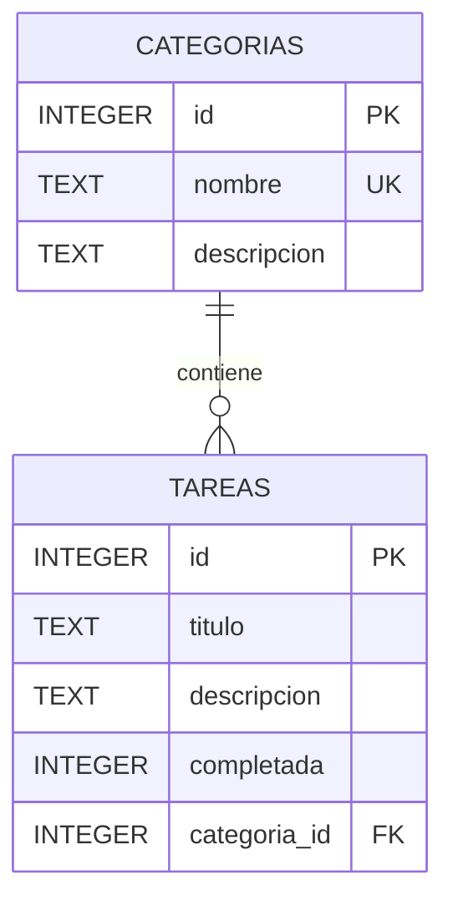

# Lista de tareas con C# y SQLite

Aplicación de consola que permite gestionar una **lista de tareas** mediante **C#**, **.NET 8** y una base de datos **SQLite**.

El proyecto sigue una estructura parecida a la del juego del ahorcado mapeado a clases: cada tabla principal se representa con una clase de C#, los objetos contienen sus propios métodos CRUD y las clases gestoras se ocupan únicamente de los menús y de la interacción con el usuario.

Se ha priorizado que el código sea **sencillo, legible y fácil de modificar**, aunque algunas decisiones no sean las más sofisticadas para una aplicación profesional de gran tamaño.

---

## Características

- CRUD completo de tareas:
  - Crear una tarea.
  - Mostrar todas las tareas.
  - Mostrar las tareas de una categoría.
  - Modificar una tarea.
  - Eliminar una tarea.
- CRUD completo de categorías:
  - Crear una categoría.
  - Mostrar las categorías.
  - Modificar una categoría.
  - Eliminar una categoría.
- Cada tarea pertenece a una sola categoría.
- Posibilidad de marcar las tareas como pendientes o completadas.
- Listado de todas las tareas agrupadas por categorías.
- Base de datos SQLite incluida con categorías y tareas de ejemplo.
- Consultas parametrizadas mediante `AddWithValue`.
- Claves externas activadas con `PRAGMA foreign_keys = ON`.
- Mapeo de tablas a clases mediante un patrón de registro activo sencillo.
- Código sin `namespace`, para facilitar su uso en un único proyecto educativo.

---

## Objetivos didácticos

Este proyecto permite practicar:

### Programación orientada a objetos

- Creación de clases y objetos.
- Atributos privados y propiedades públicas.
- Constructores.
- Encapsulación.
- Métodos de instancia y métodos estáticos.
- Sobrescritura de `ToString()`.
- Composición de objetos.
- Separación de responsabilidades.

### Bases de datos

- Conexión a SQLite desde C#.
- Uso de `SqliteConnection`.
- Uso de `SqliteCommand`.
- Uso de `SqliteDataReader`.
- Operaciones `INSERT`, `SELECT`, `UPDATE` y `DELETE`.
- Claves primarias y claves externas.
- Restricciones `NOT NULL`, `UNIQUE` y `CHECK`.
- Índices.
- Consultas parametrizadas.
- Conversión de filas de una consulta en objetos de C#.

### Programación general

- Menús repetitivos con `while`.
- Selección de opciones con `switch`.
- Validación de datos introducidos por consola.
- Uso de `List<T>`.
- Valores anulables como `Categoria?` y `Tarea?`.
- Codificación UTF-8.

---

## Tecnologías utilizadas

| Tecnología | Uso |
|---|---|
| C# | Lenguaje principal |
| .NET 8 | Plataforma de ejecución |
| SQLite | Base de datos almacenada en un fichero |
| Microsoft.Data.Sqlite | Acceso a SQLite desde .NET |
| ADO.NET | Ejecución de órdenes SQL y lectura de resultados |

Dependencia NuGet:

```xml
<PackageReference Include="Microsoft.Data.Sqlite" Version="8.0.12" />
```

---

## Estructura del proyecto

```text
ListaTareasSQLiteMapeada/
│
├── Program.cs
├── BaseDatos.cs
├── Categoria.cs
├── Tarea.cs
├── GestorCategorias.cs
├── GestorTareas.cs
├── TextoUtil.cs
├── ListaTareasSQLite.csproj
├── lista_tareas.db
└── README.md
```

### `Program.cs`

Es el punto de entrada de la aplicación.

- Abre la conexión.
- Crea las tablas si no existen.
- Crea los gestores.
- Muestra el menú principal.

### `BaseDatos.cs`

Contiene:

- La cadena de conexión.
- La creación de la conexión.
- La activación de las claves externas.
- La creación de tablas e índices.

### `Categoria.cs`

Representa la tabla `categorias`.

Incluye:

- `Id`.
- `Nombre`.
- `Descripcion`.
- Inserción.
- Listado.
- Búsqueda por ID.
- Modificación.
- Eliminación.
- Comprobación de nombres duplicados.
- Recuento de tareas asociadas.

### `Tarea.cs`

Representa la tabla `tareas`.

Incluye:

- `Id`.
- `Titulo`.
- `Descripcion`.
- `Completada`.
- Un objeto `Categoria`.
- Inserción.
- Listado general.
- Listado por categoría.
- Búsqueda por ID.
- Modificación.
- Eliminación.

### `GestorCategorias.cs`

Se ocupa de la interfaz de consola del CRUD de categorías. No contiene sentencias SQL.

### `GestorTareas.cs`

Se ocupa de la interfaz de consola del CRUD de tareas y de los listados por categorías. No contiene sentencias SQL.

### `TextoUtil.cs`

Agrupa métodos sencillos y reutilizables para:

- Leer textos obligatorios.
- Leer números enteros positivos.
- Pedir confirmaciones.
- Pausar la consola.

---

## Mapeo de tablas a clases

El proyecto utiliza un patrón de **registro activo sencillo**:

```text
Tabla categorias  → clase Categoria
Tabla tareas       → clase Tarea
```

Cada objeto representa una fila de su tabla y contiene métodos como:

```csharp
categoria.Insertar(conexion);
categoria.Actualizar(conexion);
categoria.Borrar(conexion);

tarea.Insertar(conexion);
tarea.Actualizar(conexion);
tarea.Borrar(conexion);
```

### Relación entre `Tarea` y `Categoria`

En SQLite, una tarea guarda la clave externa:

```text
categoria_id
```

En C#, una tarea contiene el objeto completo:

```csharp
public Categoria Categoria
{
    get { return categoria; }
    set { categoria = value; }
}
```

Esto permite escribir:

```csharp
Console.WriteLine(tarea.Categoria.Nombre);
```

Al insertar o modificar se utiliza:

```csharp
tarea.Categoria.Id
```

---

## Base de datos

La base de datos utiliza dos tablas relacionadas.



### Tabla `categorias`

```sql
CREATE TABLE categorias (
    id INTEGER PRIMARY KEY AUTOINCREMENT,
    nombre TEXT NOT NULL UNIQUE COLLATE NOCASE,
    descripcion TEXT NOT NULL
);
```

### Tabla `tareas`

```sql
CREATE TABLE tareas (
    id INTEGER PRIMARY KEY AUTOINCREMENT,
    titulo TEXT NOT NULL,
    descripcion TEXT NOT NULL,
    completada INTEGER NOT NULL DEFAULT 0,
    categoria_id INTEGER NOT NULL,
    CHECK (completada IN (0, 1)),
    FOREIGN KEY (categoria_id)
        REFERENCES categorias(id)
        ON DELETE RESTRICT
);
```

El campo `completada` utiliza:

- `0`: tarea pendiente.
- `1`: tarea completada.

---

## Relación entre las tablas

Para recuperar cada tarea junto con su categoría se utilizan las dos tablas:

```sql
SELECT
    ta.id AS tarea_id,
    ta.titulo,
    ta.descripcion,
    ta.completada,
    ca.id AS categoria_id,
    ca.nombre,
    ca.descripcion AS categoria_descripcion
FROM tareas ta, categorias ca
WHERE ta.categoria_id = ca.id;
```

La condición importante es:

```sql
WHERE ta.categoria_id = ca.id
```

Sin esa condición, cada tarea se combinaría incorrectamente con todas las categorías.

---

## Consultas parametrizadas y SQL Injection

Los datos escritos por el usuario nunca se concatenan dentro de una consulta SQL.

Ejemplo utilizado en el proyecto:

```csharp
string sql =
    "DELETE FROM tareas " +
    "WHERE id = @id";

SqliteCommand cmd = new SqliteCommand(sql, conexion);
cmd.Parameters.AddWithValue("@id", id);
```

Esto permite:

- Evitar SQL Injection.
- Gestionar correctamente las comillas.
- Separar el SQL de los datos.
- Mejorar la legibilidad.

---

## CRUD de tareas

| Operación | Método | SQL |
|---|---|---|
| Crear | `Tarea.Insertar()` | `INSERT` |
| Leer | `Tarea.Listar()` | `SELECT` |
| Leer por categoría | `Tarea.ListarPorCategoria()` | `SELECT` |
| Leer por ID | `Tarea.BuscarPorId()` | `SELECT` |
| Modificar | `Tarea.Actualizar()` | `UPDATE` |
| Eliminar | `Tarea.Borrar()` | `DELETE` |

---

## CRUD de categorías

| Operación | Método | SQL |
|---|---|---|
| Crear | `Categoria.Insertar()` | `INSERT` |
| Leer | `Categoria.Listar()` | `SELECT` |
| Leer por ID | `Categoria.BuscarPorId()` | `SELECT` |
| Modificar | `Categoria.Actualizar()` | `UPDATE` |
| Eliminar | `Categoria.Borrar()` | `DELETE` |

Una categoría no puede eliminarse mientras tenga tareas asociadas. Esta regla se protege de dos formas:

1. El programa comprueba `Categoria.ContarTareas()`.
2. SQLite utiliza `ON DELETE RESTRICT`.

---

## Contenido inicial de la base de datos

La base incluida contiene cuatro categorías:

- Trabajo.
- Estudios.
- Personal.
- Hogar.

También contiene ocho tareas de ejemplo, algunas pendientes y otras completadas.

---

## Ejecución

### Visual Studio

1. Abre `ListaTareasSQLite.csproj`.
2. Espera a que se restauren los paquetes NuGet.
3. Ejecuta con `Ctrl + F5`.

### Terminal

```bash
dotnet restore
dotnet run
```

Para compilar:

```bash
dotnet build
```

El fichero `.csproj` copia automáticamente `lista_tareas.db` al directorio de salida.

---

## Menú principal

```text
====================================
          LISTA DE TAREAS
====================================
1. Gestionar tareas (CRUD)
2. Gestionar categorías (CRUD)
3. Listar tareas por categorías
0. Salir
------------------------------------
Selecciona una opción:
```

Las tareas se representan así:

```text
[ ] 1. Preparar material de C# [Trabajo] - Revisar el ejemplo de SQLite.
[X] 2. Responder correos [Trabajo] - Contestar los mensajes pendientes.
```

- `[ ]` indica que la tarea está pendiente.
- `[X]` indica que la tarea está completada.

---

## Decisiones de diseño

### Código sencillo antes que arquitectura avanzada

No se utilizan repositorios, servicios, interfaces ni un ORM. El objetivo es que el alumnado pueda seguir fácilmente el recorrido completo desde el menú hasta la consulta SQL.

### Una conexión compartida

La conexión se abre una sola vez en `Program` y se comparte con los gestores y los objetos que la necesitan.

### SQL dentro de las clases mapeadas

`Categoria` contiene las operaciones de la tabla `categorias` y `Tarea` contiene las operaciones de la tabla `tareas`.

### Categorías protegidas

No se permite borrar una categoría que todavía contenga tareas. Primero hay que eliminar las tareas o moverlas a otra categoría.

---

## Posibles ampliaciones

- Añadir fechas límite.
- Añadir prioridades.
- Buscar tareas por texto.
- Mostrar solo tareas pendientes.
- Mostrar solo tareas completadas.
- Ordenar por fecha o prioridad.
- Añadir usuarios.
- Guardar la fecha de creación.
- Añadir etiquetas múltiples.
- Crear una interfaz gráfica.
- Añadir pruebas unitarias.
- Separar el acceso a datos mediante repositorios.

---

## Uso educativo

Este proyecto puede utilizarse para otros proyectos con similares características:

- CRUD completo con dos tablas.
- Relaciones uno a muchos.
- Claves externas.
- Mapeo entre filas y objetos.
- Composición de objetos.
- Consultas parametrizadas.
- Separación entre interfaz y acceso a datos.
- Validación de datos de entrada.

La estructura está pensada para poder añadir nuevas propiedades y funcionalidades sin tener que comprender primero una arquitectura compleja.
